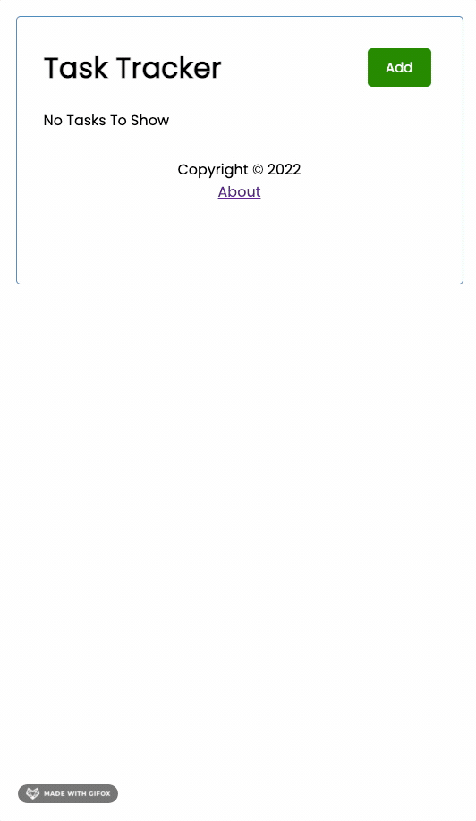
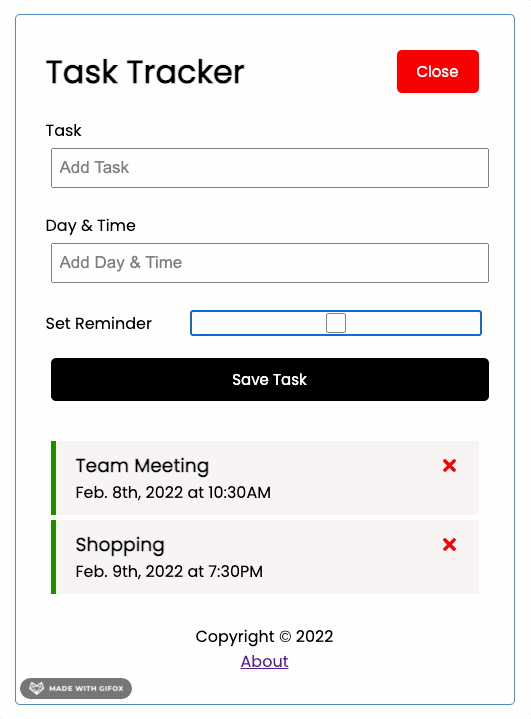

# Task Tracker

Simple tracker to add and delete to-do tasks, and also set reminder.

## App Demo

### Adding a Task and Toggling Reminder


### Deleting Tasks and Switching Between Routes


## Setup

Install dependencies with `npm install`.

In the project directory, you can run:

```sh
npm start
```